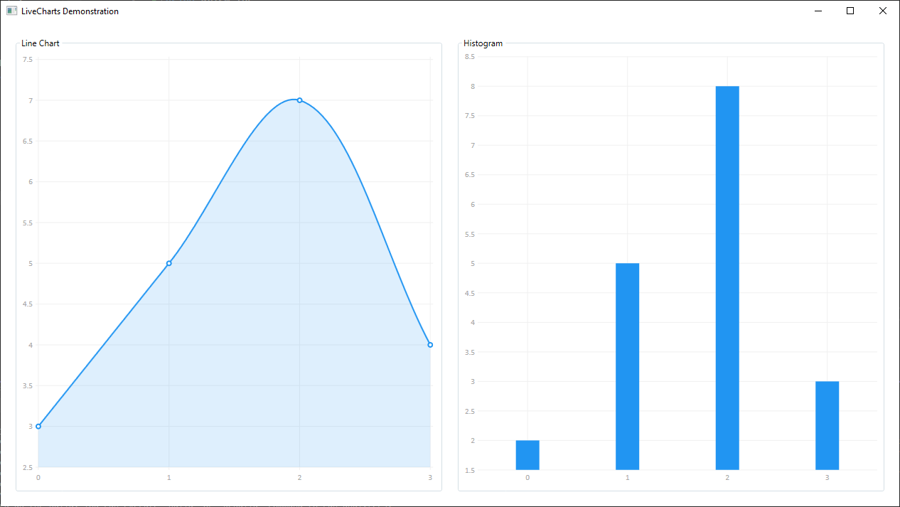

# LiveCharts Demonstration Application

This is a simple demonstration application showcasing brief use of the LiveCharts library.

It is a C# WPF application using the MVVM framework Prism.



## LiveCharts Installation

It is possible to install LiveCharts using the Package Manager Console or Manage NuGet Packages...

For more information, take a look at [LiveCharts' documentation](https://v0.lvcharts.com/App/examples/v1/Wpf/Install).

### Using the Package Manager Console

1. Execute this command to install LiveCharts:

	```
	PM> Install-Package LiveCharts.wpf
	```

### Using NuGet Package Manager

1. In the navigation bar, click on `Tools`, and then on `NuGet Package Manager`. In the list, select `Manage NuGet Packages for Solution...`

2. Browse packages and search for `LiveCharts.wpf`

3. Select and install LiveCharts:

	> **LiveCharts.Wpf** by Beto Rodriguez  
	> Simple, flexible, interactive and powerful data visualization for Wpf